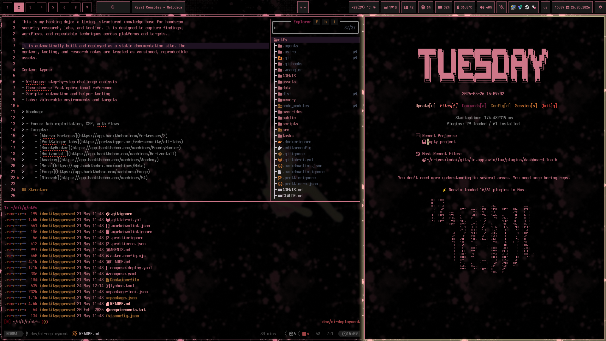
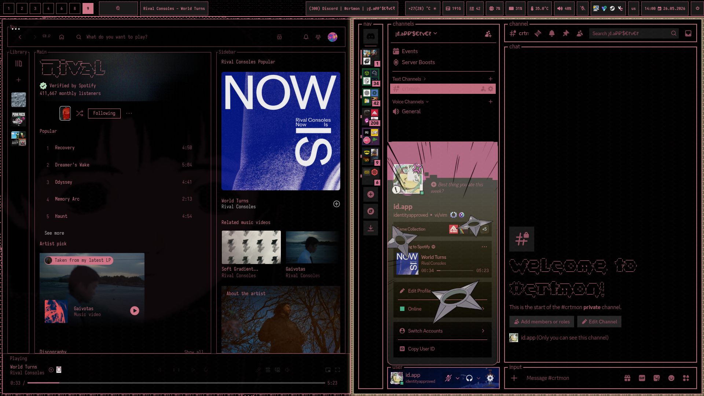
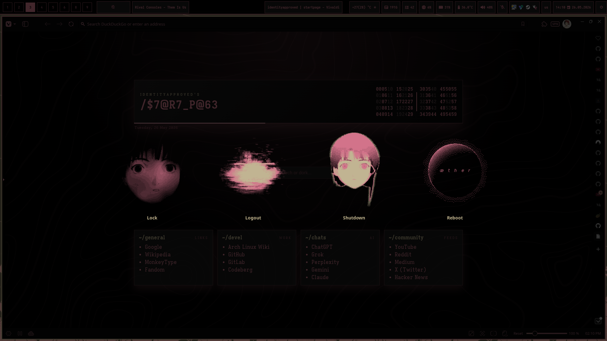
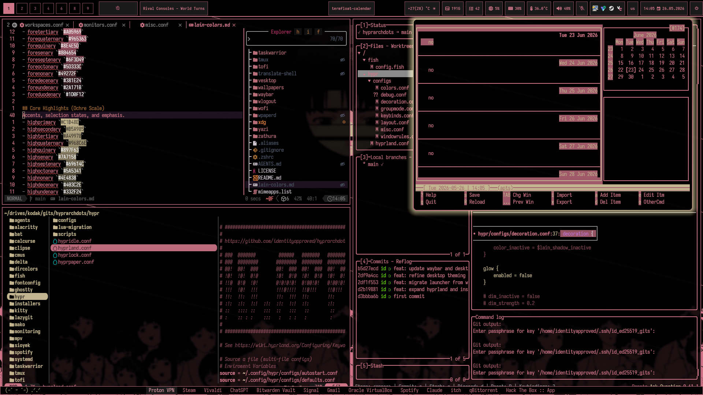

# Lainland Dotfiles

> *Let's all love Lain.*

Arch + Hyprland dotfiles built around a cohesive Serial Experiments Lain palette. Modular installers, practical defaults, and Lain theming carried across the full desktop stack.

> [!WARNING]
> These dotfiles are still in progress. Use at your own risk.

---

## Screenshots

<p align="center">
  
  
  
  
</p>

---

## Requirements

Install these first:

- `git`
- `base-devel`

If gaming is needed (Steam + Proton), enable `multilib` first.

Preferred during install:

- In `archinstall` → `Additional repositories` → enable `multilib`

Manual way:

```bash
sudo nano /etc/pacman.conf
```

Uncomment:

```ini
[multilib]
Include = /etc/pacman.d/mirrorlist
```

Then sync:

```bash
sudo pacman -Syu
```

---

## Install Flow

Modular installer structure lives under `installers/`.

```bash
bash installers/installer_menu.sh
```

---

## Themed Tools (Lain Palette)

### WM / Desktop

| Tool | Notes |
|------|-------|
| `hyprland` | Colors, borders, shadows, animations, window rules, scripts |
| `waybar` | Full lain-colored bar with pomodoro/timer module |
| `mako` | Notification daemon |
| `wlogout` | Logout/power menu |
| `wpaperd` | Wallpaper daemon |

### Terminals

| Tool | Notes |
|------|-------|
| `kitty` | Primary terminal |
| `ghostty` | Alt terminal, lain config |
| `tmux` | Multiplexer with lain status line |

### Launcher / Navigation

| Tool | Notes |
|------|-------|
| `tofi` | App launcher (replaced wofi) |
| `yazi` | File manager with lain flavor + plugins |

### Dev / CLI

| Tool | Notes |
|------|-------|
| `delta` | Diff pager, lain syntax coloring |
| `lazygit` | Git TUI styled to match |
| `bat` | Cat replacement, custom `Lain.tmTheme` (rose/ochre palette) |
| `dircolors` | `ls` colors to match palette |

### Media

| Tool | Notes |
|------|-------|
| `spotify` | Spicetify `lain` theme |
| `cmus` | Terminal music player |
| `mpv` | Media player config |

### Productivity

| Tool | Notes |
|------|-------|
| `taskwarrior` | Task management with lain theme |
| `calcurse` | Calendar / todo |
| `zathura` | PDF reader |
| `sioyek` | PDF reader, single lain config |
| `translate-shell` | Translation CLI |

### Communication

| Tool | Notes |
|------|-------|
| `vesktop` | Discord client with `lain.theme.css` |

### Utilities

| Tool | Notes |
|------|-------|
| `clipse` | Clipboard manager |
| `fontconfig` | Font rendering config |

---

## Thanks / Credits / Inspiration

- **[Ascaniolamp/Hyprlain](https://github.com/Ascaniolamp/Hyprlain)** — the original Lain rice that started it all. Waybar layout and several theming ideas are heavily inspired by this work. Go star it.
- **[niraletter/waybar-timer](https://github.com/niraletter/waybar-timer)** — pomodoro/timer waybar module.
- **Serial Experiments Lain** — Yoshitoshi ABe, Yasuyuki Ueda, Ryutaro Nakamura. Watch it.
